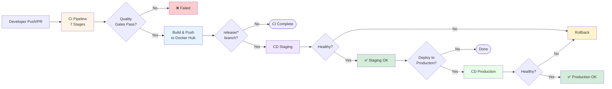
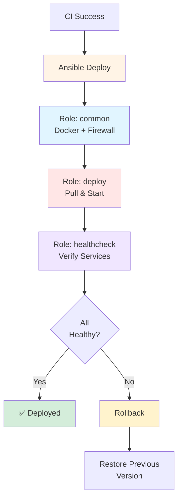

# EcoCycle Pipeline Diagrams (Compact for 5-Page Report)

**Use ONLY these 2 compact diagrams in your report.**

---

## Diagram 1: Overall CI/CD Pipeline (Section 3.1)



**Pipeline Stages:** Validation → Code Quality (Checkstyle) → Testing (JUnit/JaCoCo) → Static Analysis (SpotBugs) → Security (OWASP/Hadolint/Trivy) → Docker Build → Summary

---

## Diagram 2: CD Deployment Flow (Section 3.3)



**Ansible Roles:** common (VM setup), deploy (container deployment), healthcheck (service verification)

---

## How to Use

### Copy into Report (Recommended)
1. Copy Diagram 1 code → Paste in PROJECT_REPORT.md Section 3.1
2. Copy Diagram 2 code → Paste in PROJECT_REPORT.md Section 3.3

### Alternative: Export as Image
1. Go to https://mermaid.live
2. Paste the diagram code
3. Export as PNG (smaller file size for PDF)
4. Insert image in your report

---

## Optional: Text-Only Flow (if diagrams still too large)

If the diagrams make your report too long, use this simple text description instead:

**CI/CD Pipeline Flow:**
```
Developer Push → CI (7 stages) → Quality Gates → Docker Build → Docker Hub
                                       ↓ (if pass)
                              CD Staging → Health Check → ✅ Success
                                       ↓ (if approved)
                              CD Production → Health Check → ✅ Success
                                       ↓ (if fail)
                                    Rollback
```

**CD Deployment:**
```
CI Success → Ansible (3 roles) → Health Check
   ↓            ↓                    ↓
Setup VM → Deploy Containers → Verify → ✅ Success or ⚠️ Rollback
```

---

**That's it! Just 2 compact diagrams that fit nicely in a 5-page report.**
