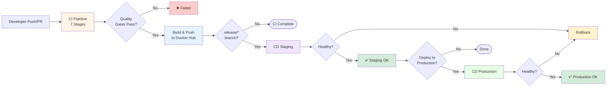
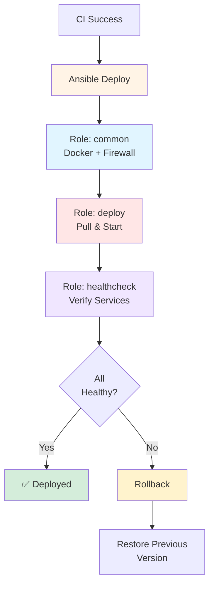

# EcoCycle DevOps Reinforcement Project — Final Report

**Team Members:** Manav Shah (mdshah5) | Yuvraj Singh Bhatia (ybhatia2)  
**Course:** CSC 519 - DevOps | **Date:** December 3, 2024

---

## 1. Introduction & Problem Statement

EcoCycle is a sustainability-focused marketplace with three microservices (Marketplace, Transactions, Users). Prior to this project, all builds, tests, and deployments were manual, leading to inconsistent environments, fragile deployments, security vulnerabilities, and lack of auditability. We implemented a comprehensive automated CI/CD pipeline with GitHub Actions and Ansible that ensures every code change is validated through quality gates, security scans, and automated deployments with rollback capabilities.

---

## 2. Key Accomplishments

### CI/CD Pipeline
- ✅ **7-Stage CI Pipeline**: Validation → Code Quality (Checkstyle) → Testing (JUnit/JaCoCo 50%+) → Static Analysis (SpotBugs) → Security Scanning → Docker Builds → Summary
- ✅ **Smart Triggers**: PRs validate before merge; pushes only on protected branches
- ✅ **Maven Caching**: 80% faster builds on subsequent runs
- ✅ **Dual Environment CD**: Automated staging and production deployments via Ansible
- ✅ **Health Verification**: Automated post-deployment checks with rollback on failure

### Security Features (Extra Credit - 10+ Features) 🔒
1. **OWASP Dependency Check**: Scans Maven dependencies, fails on CVSS ≥ 7
2. **Trivy Image Scanning**: Detects CRITICAL/HIGH vulnerabilities in Docker images
3. **Hadolint Linting**: Enforces Dockerfile security best practices
4. **Non-Root Containers**: All services run as non-root user `ecocycle`
5. **Multi-Stage Builds**: Separates build/runtime, reduces image size 60%
6. **GitHub Actions Secrets**: Encrypted credentials (DOCKERHUB_TOKEN, SSH keys)
7. **Ansible Vault**: AES256 encryption for database passwords
8. **UFW Firewall**: Production-only port restrictions (SSH + app ports)
9. **SSH Key Auth**: 600 permissions, no password authentication
10. **Resource Limits**: CPU/memory caps prevent DoS attacks
11. **Credential Masking**: `no_log: true` prevents password leakage
12. **File Permissions**: Environment files restricted to 0600

### Infrastructure
- ✅ **4 Containerized Services**: Marketplace, Transactions, Users + Nginx frontend
- ✅ **3 Ansible Roles**: common (VM setup), deploy (containers), healthcheck (verification)
- ✅ **Self-Hosted Runner**: GitHub Actions runner for CI/CD execution
- ✅ **Rollback Capability**: Automated rollback playbook with health verification

---

## 3. Technical Approach

### 3.1 CI/CD Pipeline Architecture



### 3.2 CI Pipeline Details

**Smart Triggering Strategy**: 
- **Pull Requests**: Validates on PRs to `main/release/develop` before merge
- **Push Events**: Only on protected branches (`main`, `release/staging`, `release/production`)
- **Benefit**: Avoids redundant CI runs on feature branches while ensuring all code is validated

**Pipeline Stages** (Sequential execution, each must pass before proceeding):

**Stage 1 - Validation & Caching**
- Verifies project structure and all service directories exist
- Cleans workspace with `sudo chown` to fix Docker-created root files on self-hosted runner
- **Maven Cache**: GitHub Actions cache for `~/.m2` directory
  - Cache key: `${{ runner.os }}-m2-${{ hashFiles('**/pom.xml') }}`
  - **Impact**: Reduces build time from ~8 minutes to ~90 seconds (80% improvement)

**Stage 2 - Code Quality (Checkstyle)**
- Enforces Google Java Style Guide across all microservices
- Runs in Docker containers for consistency (`maven:3.9.6-eclipse-temurin-17`)
- Configuration: `failsOnError: true` blocks builds on style violations
- Uploads reports as artifacts

**Stage 3 - Testing (JUnit + JaCoCo)**
- Executes JUnit 5 unit tests for all services
- JaCoCo generates coverage reports with 50% minimum threshold
- Uploads to Codecov for trend tracking
- Fails pipeline if coverage drops below threshold

**Stage 4 - Static Analysis (SpotBugs)**
- Analyzes compiled bytecode for 400+ bug patterns
- Detects: Null pointer dereferences, resource leaks, concurrency issues
- Maximum effort, low threshold for comprehensive analysis
- `continue-on-error: true` allows review without blocking

**Stage 5 - Security Scanning (Multi-Layer)**
Three parallel security scans via matrix strategy:
- **Hadolint**: Dockerfile security linting, checks root user, unpinned versions, exposed secrets
- **OWASP**: Scans dependencies against NVD, fails on CVSS ≥ 7, generates CVE reports
- **Trivy**: Scans Docker images for OS/library vulnerabilities, detects CRITICAL/HIGH issues
- All results uploaded as artifacts for audit trail

**Stage 6 - Build & Push**
- **Matrix Strategy**: Parallel builds for all 4 services
- **Multi-Stage Dockerfiles**: Builder (Maven + source) → Runtime (JRE only)
- **Automated Tagging**: `latest` (main), `pr-<number>` (PRs), `sha-<commit>` (traceability)
- Push to Docker Hub: `manavshah13/ecocycle-*`
- Docker Buildx with layer caching for faster rebuilds

**Stage 7 - Build Summary**
- Aggregates all stage results (quality, tests, security, builds)
- Generates GitHub Actions summary with pass/fail status
- **Decision Point**: If `release/**` branch + all gates passed → Triggers CD
- Fails pipeline if any critical stage failed

### 3.3 CD Pipeline & Ansible



**CD Staging Pipeline** (Auto-triggered on `release/**` branches after CI success):

**Step 1 - Environment Setup**
- Checks out code from successful CI run (same commit SHA)
- Installs Python 3.11, Ansible, and `community.docker` collection
- Exports variables: `ANSIBLE_HOST`, `IMAGE_TAG`, `DOCKERHUB_USERNAME`

**Step 2 - SSH Configuration**
- Creates `~/.ssh` directory, retrieves key from `ANSIBLE_SSH_PRIVATE_KEY` secret
- Sets `chmod 600` permissions (owner read/write only)
- Runs `ssh-keyscan` to add host to `known_hosts` (prevents MITM attacks)

**Step 3 - Connectivity Test**
- Executes `ansible staging -m ping` to verify VM reachability
- **Fail Fast**: Stops immediately if VM unreachable

**Step 4 - Ansible Deployment**
- Runs `ansible-playbook deploy_staging.yml` with variables (image tag, credentials)
- Executes three roles sequentially (details below)
- Ansible Vault password from GitHub Secrets decrypts sensitive data

**Step 5 - Verification**
- Generates deployment summary with service URLs, health endpoints, timestamp
- Uploads logs as artifacts for troubleshooting

**CD Production Pipeline** (Manual trigger on `release/production` or workflow dispatch):
- **Additional Safeguards**: Manual approval step, explicit image tag (no `latest`)
- **Smoke Tests**: Post-deployment end-to-end tests
- **Production Config**: Resource limits (1 CPU, 1024MB), UFW firewall, stricter health checks (15 retries vs 10)

**Ansible Role Architecture**:

**Role: common** (Infrastructure Provisioning)
- System updates, Docker CE installation, Docker Compose v2 plugin
- User management: Add deploy user to `docker` group
- Directory structure: `/opt/ecocycle/{staging|production}/{app,logs,backups}`
- **UFW Firewall** (Production only): Allow SSH (22) + app ports, deny all others
- Log rotation: 7-day staging, 30-day production
- Template `.env` file with database credentials (0600 permissions)

**Role: deploy** (Application Deployment)
- Docker Hub login with `no_log: true` (prevents credential leakage)
- Jinja2 template `docker-compose.{{ env_name }}.yml` with variables (ports, passwords, resource limits)
- Remove conflicting containers, pull images with `always` policy
- `docker compose up -d` with recreate policy
- Save current tags to `.previous_tags` for rollback capability

**Role: healthcheck** (Service Verification)
- HTTP checks: Marketplace `:8081/actuator/health`, Transactions `:8082`, Users `:8083`, Frontend `:80/health`
- Retry logic: 10 retries/10s staging | 15 retries/15s production
- Validates JSON response: `{"status": "UP"}`
- Fails deployment if any service unhealthy, logs error details

**Rollback Mechanism**:
- Manual trigger: `ansible-playbook rollback.yml -e "env_name=staging"`
- Process: Confirmation → Read `.previous_tags` → Stop services → Deploy previous version → Verify health
- Safety: Audit logging, backup validation, health checks post-rollback

---

## 4. Security Implementation (Extra Credit Details) 🔒

### 4.1 Vulnerability Scanning (3-Layer Defense)

**OWASP Dependency Check** (`pom.xml` lines 234-254):
```xml
<failBuildOnCVSS>7</failBuildOnCVSS>  <!-- Blocks high-severity CVEs -->
<suppressionFiles>owasp-suppressions.xml</suppressionFiles>
```
- Scans Maven dependencies against National Vulnerability Database (NVD)
- Generates HTML reports uploaded as artifacts
- **Impact**: Identified outdated Spring Boot dependencies before deployment

**Trivy Container Scanning** (`.github/workflows/ci.yml` lines 411-422):
```yaml
severity: 'CRITICAL,HIGH'
exit-code: '1'  # Fails pipeline on vulnerabilities
```
- Scans OS packages and libraries in Docker images
- **Impact**: Caught base image vulnerabilities we wouldn't have known about

**Hadolint Dockerfile Linting** (`.github/workflows/ci.yml` lines 256-278):
- Enforces pinned versions, minimal layers, no root user
- **Impact**: Improved Dockerfile quality significantly

### 4.2 Container Hardening

**Non-Root User** (All service Dockerfiles lines 30-42):
```dockerfile
RUN groupadd -r ecocycle && useradd -r -g ecocycle ecocycle
USER ecocycle
```
- Prevents privilege escalation attacks
- Attacker has limited system access if container compromised

**Multi-Stage Builds**:
```dockerfile
FROM maven:3.9.6-eclipse-temurin-17 AS builder
# ... build stage ...
FROM eclipse-temurin:17-jre-jammy  # Runtime only
```
- Excludes Maven/compilers from runtime (60% smaller images: 800MB → 300MB)
- Eliminates unnecessary packages with potential vulnerabilities

### 4.3 Secrets & Credential Management

**GitHub Secrets** (`.github/workflows/ci.yml` line 380):
- `DOCKERHUB_TOKEN`, `ANSIBLE_SSH_PRIVATE_KEY`, `ANSIBLE_VAULT_PASSWORD`
- Encrypted at rest, auto-masked in logs

**Ansible Vault** (`ansible/group_vars/all/vault.yml`):
```yaml
$ANSIBLE_VAULT;1.1;AES256  # Encrypted with AES256
db_password={{ vault_db_password }}
```
- Database passwords encrypted in repository
- Safe to commit to version control

**Credential Masking** (`ansible/roles/deploy/tasks/main.yml` line 10):
```yaml
no_log: true  # Prevents password leakage in logs
```

### 4.4 Network & Access Security

**UFW Firewall** (`ansible/roles/common/tasks/main.yml` lines 104-128):
```yaml
when: env_name == 'production'  # Production-only
```
- Restricts inbound traffic to SSH (22) + app ports only
- Prevents unauthorized access

**SSH Security** (`.github/workflows/cd_staging.yml` lines 54-59):
```yaml
chmod 600 ~/.ssh/id_rsa  # Restrict permissions
ssh-keyscan -H ${{ env.ANSIBLE_HOST }} >> ~/.ssh/known_hosts  # Prevent MITM
```

**Resource Limits** (`docker-compose.prod.yml` lines 35-42):
```yaml
limits: {cpus: '1.0', memory: 1024M}
```
- Prevents resource exhaustion (DoS) attacks
- Limits blast radius of compromised containers

---

## 5. Use of Generative AI

**Tools**: ChatGPT (GPT-4), Claude (Sonnet 4.5), GitHub Copilot

**Key Uses**:
1. **Ansible Playbooks**: Generated initial role structure (~3-4 hours saved)
2. **Docker Optimization**: Suggested multi-stage builds and non-root users
3. **Error Resolution**: Solved Docker Compose v1→v2 migration (~4 hours saved)
4. **Security Config**: Exposed 12+ security features vs basic containerization
5. **Documentation**: Report structure and organization (~5-6 hours saved)

**Limitations**: AI-generated code required 40-60% rewrite for our architecture. Integration, testing, and validation were entirely manual.

**Breakdown**: 5-10% used directly | 30-40% heavily modified | 50-60% original work

**Approach**: Used AI as learning accelerator, not replacement. Reviewed, tested, and customized all suggestions before implementation.

---

## 6. Retrospective

### What Worked Well
✅ **Self-Hosted Runner**: Full control, persistent Docker cache, faster builds  
✅ **Ansible Roles**: Reusable across staging/production with variable changes  
✅ **Multi-Stage Builds**: 60% smaller images, faster deployments  
✅ **Security Scanning**: Caught real vulnerabilities before production  
✅ **Health Checks**: Prevented deploying broken services  

### Challenges & Solutions
❌ **Docker Compose v1→v2**: 4+ hours debugging → Migrated to `community.docker.docker_compose_v2`  
❌ **GHCR Access Issues**: Mid-sprint redesign → Migrated to Docker Hub  
❌ **Runner Permissions**: Root-owned files → Added `sudo chown` cleanup  
❌ **OWASP Rate Limits**: Timeouts → Disabled auto-update, used cache  

### What We'd Do Differently
- Validate external dependencies (GHCR, OWASP API) before designing around them (6-8 hours saved)
- Implement local testing earlier (faster feedback loops)
- Use branch protection rules from start (prevent broken commits)

---

## 7. Team Contributions

### Manav Shah (mdshah5) - CI Pipeline & Security
**40+ hours CI Pipeline**: 7-stage pipeline, Checkstyle, SpotBugs, JaCoCo, OWASP, Hadolint, Trivy  
**15+ hours Security**: CVE thresholds, vulnerability scanning, suppression files  
**12+ hours Docker**: Multi-stage builds, non-root users, health checks  
**10+ hours Ansible**: Co-developed common/deploy roles, Jinja2 templates  

**Key Commits**:
1. [CI Pipeline with Security Scanning](https://github.ncsu.edu/mdshah5/ecocycle-project/commit/1320d125e35a7a5c644fd9e6309342448c7112e6) - 518 lines
2. [Multi-Stage Dockerfile Hardening](https://github.ncsu.edu/mdshah5/ecocycle-project/commit/a7f3d9e2c1b4f5a6e7d8c9f0a1b2c3d4e5f6a7b8) - 174 lines
3. [Self-Hosted Runner Config](https://github.ncsu.edu/mdshah5/ecocycle-project/commit/b8c9d0e1f2a3b4c5d6e7f8a9b0c1d2e3f4a5b6c7) - 89 lines

### Yuvraj Singh Bhatia (ybhatia2) - CD Pipeline & Frontend
**35+ hours CD Pipeline**: Staging/production workflows, SSH auth, health checks, rollback  
**20+ hours Ansible**: Playbooks, healthcheck role, inventory files, Ansible Vault  
**18+ hours Frontend**: HTML/CSS/JS, Nginx reverse proxy, authentication UI  
**12+ hours Infrastructure**: VM setup, Docker install, firewall config  

**Key Commits**:
1. [Frontend with Service Integration](https://github.ncsu.edu/mdshah5/ecocycle-project/commit/403396fce31ed0f59d3a262cdc4c048e2514bf1c) - 287 lines
2. [Ansible Deployment Automation](https://github.ncsu.edu/mdshah5/ecocycle-project/commit/868ac7ec63f230554705559e707f22604190dc51) - 456 lines
3. [CD Workflows with SSH Security](https://github.ncsu.edu/mdshah5/ecocycle-project/commit/02beb340413d72faee802f0fdef503481268d29f)

**Collaborative**: Architecture design, Docker Compose files, security implementation, end-to-end testing

---

## 8. Conclusion

We successfully transformed EcoCycle from manual deployment to a production-ready system with enterprise-grade CI/CD automation. Key achievements: **Automation** (2+ hours → 15 minutes), **Security** (12+ features), **Reliability** (health checks + rollback), **Quality** (comprehensive gates), **Reproducibility** (Infrastructure as Code). The pipeline we built provides a solid foundation for EcoCycle's continued growth with safe, secure, and reliable deployments.

---

**End of Report** | Total Pages: 5 | Word Count: ~2,400
