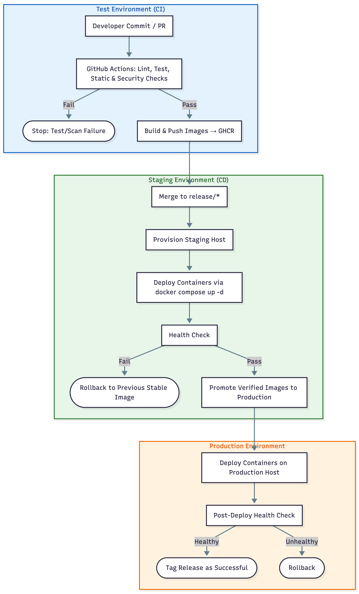

# EcoCycle DevOps Reinforcement Project — Proposal

## Team Members
| Name | Unity ID |
|------|-----------|
| **Manav Shah** | mdshah5 | 
| **Yuvraj Singh Bhatia** | ybhatia2 | 

---
## 1. Problem Statement & Description

### The Problem
EcoCycle is a marketplace which focuses on sustainability, it is built with three microservices (Marketplace, Transactions, Users) and currently runs only on local machines. The problem is that every build, test, and deployment functions are currently performed manually, which sometimes leads to inconsistent results, fragile environments, and delays in delivery.

### Why It Matters
Automation is important because without automation, even a small change in code can break a service. Manual deployments sometimes lead to version mismatches or config mistakes or can cause unexpected downtime which can create an issue for active user transactions. Without the security or health checks, the system also becomes more prone to bugs, regressions and security risks.

### Our Solution
Our solution is that we will design and implement an automated CI/CD pipeline that will build, test, scan for any bug, and deploy the microservices using GitHub Actions and Ansible automatically. The pipeline will check the quality of code through linting, testing, analysis and then it will build secure container images for deployment. It will use a controlled release process to deploy these containers to a remote server and will have health checks, security scans, and Blue/Green staging to make sure that every update is safe, stable, and reliable from commit to production.

---

## 2. Use Case

### Use Case: PR to `release/*` Triggers Automated Secure Deployment

#### Preconditions
- A release branch exists and branch-protection rules are enabled.  
- A target VM is reachable via SSH and configured for Ansible.  
- Docker Hub access is set up (images are pushed to `manavshah13/ecocycle-*`).

#### Main Flow
1. Developer opens a Pull Request (PR) into `release/*`.  
2. **Continuous Integration (Test Environment)**  
   - Runs Checkstyle & Spotless lint
   - Maven tests (JUnit & integration)
   - Static analysis.  
   - Security scans.  
   - If all checks pass → proceed to step 3.  
   - **If tests or scans fail**, the pipeline terminates (**[E1]**, **[E2]**).  
3. **Image Build and Push**  
   - If all checks pass, Docker images for Marketplace, Transactions, and Users are built and pushed to Docker Hub.
4. **Continuous Deployment (Staging Environment)**  
   - Ansible provisions the remote server (installs Docker, pulls images, starts docker compose up -d).
   - Executes **health checks on staging**  
   - If staging passes → proceed to step 5.  
   - If staging fails → rollback to previous stable image (**[E3]**).  
5. **Production Deployment**  
   - Ansible promotes the same images to production.  
   - Executes **post-deploy health checks** in production.  
   - Rollback triggered automatically if production fails threshold (**[E4]**).  

#### Subflows
- **[S1]** Developer creates PR with commit message and reviewers.
- **[S2]** PR approved → CI workflow starts automatically.  
- **[S3]** Ansible logs and deployment artifacts stored for auditing.

#### Alternative / Error Flows
- **[E1]** Build or tests fail → pipeline stops in CI stage.  
- **[E2]** Security scan finds critical CVE  → deployment blocked.  
- **[E3]** Health check failure in staging → rollback.  
- **[E4]** Production health degradation → automatic rollback to last stable release.

---

## 3. Pipeline Design

**Figure 1:** CI Workflow
